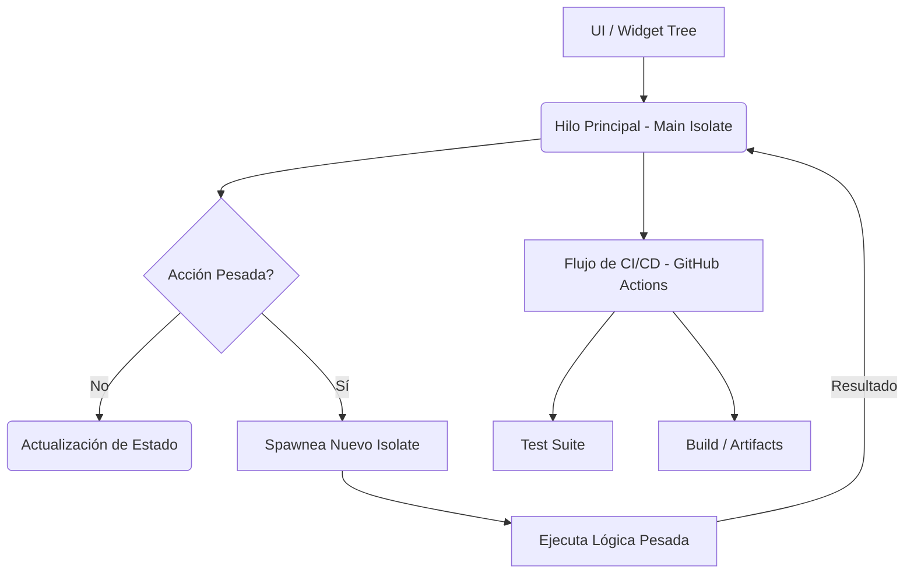

¡Entendido\! Diseñemos un **Taller Práctico Conectado** utilizando **Flutter** y los temas solicitados. Asumo el nivel **principiante** por defecto.

-----

## Título del taller

🛠️ Flutter DevOPS y Paralelismo: Construyendo **'TaskFlow Pro'** 🚀

## Introducción

En el desarrollo de aplicaciones modernas, no basta con escribir código. La capacidad de **automatizar el despliegue** (DevOps) y mantener la **capacidad de respuesta de la interfaz de usuario** (multithreading) son habilidades críticas. En este taller, construirás una aplicación de gestión de tareas, **TaskFlow Pro**, que evolucionará desde una simple interfaz hasta un proyecto robusto con integración continua y procesamiento en segundo plano para manejar tareas pesadas.

## Objetivo general (SMART)

**Implementar** en una aplicación Flutter de gestión de tareas un flujo de **Integración Continua con GitHub Actions** y la capacidad de ejecutar procesos intensivos fuera del hilo principal usando **Isolates** antes de finalizar el taller.

## Objetivos específicos

  * ✅ **Configurar** un repositorio Git y un flujo de **GitHub Actions** básico para Flutter.
  * ✅ **Diseñar** una capa de negocio que simule operaciones pesadas (p. ej., persistencia).
  * ✅ **Implementar** la ejecución de tareas pesadas en un **Isolate** para evitar bloqueos del UI.
  * ✅ **Integrar** un conjunto de pruebas unitarias y de *widgets* usando una **metodología de desarrollo no-TDD**.

## Arquitectura y Flujo de la App

La aplicación tendrá un flujo simple al inicio, pero con la complejidad adicional de las tareas en segundo plano. (Usar Mermaid)



-----

## Roadmap de Pasos

1.  **Fundación del Proyecto:** Estructura y UI básica.
2.  **DevOps Básico:** Configuración de GitHub Actions (CI/CD).
3.  **Simulación de Operación Pesada:** Creación de la capa de servicio de tareas.
4.  **Paralelismo con Isolates:** Ejecución de tareas en segundo plano.
5.  **Estrategia de Testing:** Implementación de pruebas no TDD.

-----

## Pasos detallados

### Paso 1: Configurar un proyecto base en Flutter y Git

  * **Objetivo del paso:** Crear un proyecto Flutter, establecer la estructura de carpetas mínima (p. ej., `lib/models`, `lib/services`, `lib/ui`) y el *boilerplate* UI inicial para la lista de tareas.
  * **Conexión con la app:** Este es el punto de partida; la aplicación será un `StatelessWidget` con un `ListView.builder` simulando las tareas.
  * **Progresión del tema (básico → intermedio):**
      * Básico: Inicializar el proyecto, añadir un *placeholder* de datos y mostrarlos en pantalla.
      * Intermedio: Crear **clases modelo** (`Task`) y un **repositorio de datos** abstracto (`TaskRepository`) que aún no implementa la lógica, sino que devuelve datos *mock*.
  * **Decisiones de diseño a tomar (elige y justifica):**
      * Opción A: Dejar toda la lógica en el `main.dart` | Opción B: Separar la UI en `widgets` y la lógica en clases. (recomendada: **Opción B** por **separación de responsabilidades**).
  * **Guía de implementación (sin solución completa):**
      * Crea el modelo `Task` (id, title, isCompleted).
      * Define una interfaz o clase abstracta `TaskRepository`.
      * En `main.dart`, muestra una lista con 5 tareas *mock* usando la clase `Task`.
  * **Consultas sugeridas (docs oficiales/keywords):**
      * Búscalo como: “*Flutter class model design*” y “*Flutter ListView.builder example*” en la doc de **Flutter**.
  * **Preguntas catalizadoras (reflexión):**
      * “¿Qué pasaría con la legibilidad si decidieras poner el modelo de datos dentro del widget que lo consume?”
  * **Checkpoint (lo que debes ver ahora):** Una pantalla de aplicación con el título 'TaskFlow Pro' y una lista visible de 5 tareas estáticas.
  * **Retos (según nivel) con criterios de aceptación:**
      * Reto 1 (fácil): Añade un *floating action button* (FAB) que no haga nada. **Criterio:** El FAB es visible en la esquina inferior.
      * Reto 2 (medio): Crea un widget `TaskItem` que reciba un objeto `Task` y muestre un *checkbox*. **Criterio:** La lista usa el widget `TaskItem` y muestra 5 checkboxes.
  * **Errores comunes (síntomas) & pistas:**
      * Síntoma: Error de tipo `The argument type '...' can't be assigned to the parameter type '...'`. | Pista: “revisa la definición de constructores y los tipos de datos esperados en `TaskItem`.”
  * **Extensión opcional:** Haz que la lista de tareas se genere con un generador de datos aleatorios simple.

-----

### Paso 2: DevOps Básico: Configuración de Integración Continua (CI)

  * **Objetivo del paso:** Configurar un archivo **GitHub Action Workflow** que se ejecute en cada *push* a `main` y verifique la compilación y el formato del código.
  * **Conexión con la app:** Aplicamos una capa de calidad automática al proyecto existente, asegurando que el código que se fusione cumpla con estándares.
  * **Progresión del tema (básico → intermedio):**
      * Básico: Crear el archivo `.github/workflows/main.yml` y ejecutar los *jobs* `flutter pub get` y `flutter analyze`.
      * Intermedio: Añadir el *job* `flutter test --no-pub` y **cachear las dependencias** de Flutter para acelerar el proceso.
  * **Decisiones de diseño a tomar (elige y justifica):**
      * Opción A: Ejecutar el *workflow* solo en *pull requests* | Opción B: Ejecutarlo en *push* a `main` y en *pull requests*. (recomendada: **Opción B** por **cobertura total** antes y después de la fusión).
  * **Guía de implementación (sin solución completa):**
      * Crea la carpeta `.github/workflows` y el archivo `ci.yml`.
      * Define el *trigger* (`on: push: branches: [ main ]` y `pull_request`).
      * Usa las acciones de `actions/checkout@v4` y `subosito/flutter-action@v2`.
      * Define los *steps* para `flutter analyze`.
      * **Pseudocódigo (fragmento de YAML):**
        ```yaml
        jobs:
          build:
            runs-on: ubuntu-latest
            steps:
              - uses: actions/checkout@v4
              - uses: subosito/flutter-action@v2
              - run: flutter pub get
              - run: flutter analyze
        ```
  * **Consultas sugeridas (docs oficiales/keywords):**
      * Búscalo como: “*GitHub Actions for Flutter CI*” y “*cache dependencies in GitHub Actions*” en la doc de **GitHub Actions**.
  * **Preguntas catalizadoras (reflexión):**
      * “¿Por qué es importante el paso `flutter pub get` antes de `flutter analyze` en un ambiente de CI?”
  * **Checkpoint (lo que debes ver ahora):** Al hacer *push* a GitHub, el *workflow* debe ejecutarse y pasar correctamente (luz verde) en la pestaña **Actions**.
  * **Retos (según nivel) con criterios de aceptación:**
      * Reto 1 (fácil): Haz que el *workflow* ejecute `flutter format --set-exit-if-changed`. **Criterio:** La acción fallará si un archivo no cumple el formato estándar.
      * Reto 2 (medio): Crea un *job* que solo se ejecute para crear el APK (aunque falle por falta de *keys*). **Criterio:** Un nuevo *job* con el *step* `flutter build apk` aparece en la ejecución de Actions.
  * **Errores comunes (síntomas) & pistas:**
      * Síntoma: El *workflow* falla con un error de comando no encontrado. | Pista: “revisa si el *step* de *setup* de Flutter fue configurado correctamente antes de intentar ejecutar comandos `flutter`.”
  * **Extensión opcional:** Configura una insignia (*badge*) de estado del CI/CD en el *README.md* del proyecto.

-----

### Paso 3: Simulación de Operación Pesada

  * **Objetivo del paso:** Modificar la implementación del `TaskRepository` para que simule una operación de **larga duración** al cargar la lista de tareas, exponiendo el potencial bloqueo del UI.
  * **Conexión con la app:** En lugar de devolver datos *mock* instantáneamente, se introduce un retraso forzado en la capa de servicio.
  * **Progresión del tema (básico → intermedio):**
      * Básico: En el método `getTasks()`, añade un `Future.delayed(Duration(seconds: 3))` para forzar una espera. El método debe ser `async`.
      * Intermedio: Usa el patrón **Provider/ChangeNotifier** (o **Riverpod**, etc.) de estado simple para gestionar el **estado de carga** (loading) en el UI durante la espera.
  * **Decisiones de diseño a tomar (elige y justifica):**
      * Opción A: Usar `Future.delayed` | Opción B: Usar un *loop* forzado con un alto número de iteraciones. (recomendada: **Opción A** por **simular una operación I/O asíncrona** de manera limpia).
  * **Guía de implementación (sin solución completa):**
      * Implementa una clase `MockTaskRepository` con el retraso.
      * En el UI, usa un `FutureBuilder` o un *state manager* para mostrar un `CircularProgressIndicator` **mientras** se espera la respuesta.
      * **Pseudocódigo (fragmento de *repository*):**
        ```dart
        class MockTaskRepository {
          Future<List<Task>> getTasks() async {
            print("Iniciando tarea pesada...");
            await Future.delayed(const Duration(seconds: 3));
            print("Tarea pesada finalizada.");
            return [ /* lista mock de tareas */ ];
          }
        }
        ```
  * **Consultas sugeridas (docs oficiales/keywords):**
      * Búscalo como: “*Flutter FutureBuilder example*” y “*Flutter Change Notifier simple example*” en la doc de **Flutter**.
  * **Preguntas catalizadoras (reflexión):**
      * “¿Cuál es el síntoma principal de un bloqueo del hilo principal de la UI (`jank`) y por qué un `Future.delayed` *no* lo causa (si no hay cómputo pesado)?”
  * **Checkpoint (lo que debes ver ahora):** Un indicador de carga visible por 3 segundos antes de que aparezca la lista de tareas.
  * **Retos (según nivel) con criterios de aceptación:**
      * Reto 1 (fácil): Añade un pequeño *print* o *log* de depuración antes y después del retraso. **Criterio:** El *log* muestra los mensajes con la diferencia de tiempo entre ellos.
      * Reto 2 (medio): Muestra un mensaje de error si la simulación de carga falla (`throw Exception`). **Criterio:** El UI muestra el error y no la lista después de la espera.
  * **Errores comunes (síntomas) & pistas:**
      * Síntoma: El indicador de carga nunca se oculta. | Pista: “asegúrate de que la función `getTasks()` está siendo llamada y que el `FutureBuilder` maneja el estado `ConnectionState.done`.”
  * **Extensión opcional:** Simula el *jank* real cambiando el `Future.delayed` por un *loop* `for` intensivo y observa el resultado.

-----

### Paso 4: Paralelismo con Isolates

  * **Objetivo del paso:** Mover la simulación de operación pesada (el *loop* intensivo o el retraso) a un **Isolate** separado para garantizar que el hilo principal permanezca libre y responsivo.
  * **Conexión con la app:** Se modifica el `TaskRepository` para que la llamada a la función que contiene la operación pesada se realice a través de `Isolate.run` o `compute`.
  * **Progresión del tema (básico → intermedio):**
      * Básico: Usar la función `compute` (que es un *wrapper* de *isolates*) para ejecutar una función *top-level* con la simulación de carga.
      * Intermedio: Crear una función *top-level* que reciba un **argumento** (p. ej., un valor para la simulación) y **retorne** el resultado, comunicándose así entre *isolates*.
  * **Decisiones de diseño a tomar (elige y justifica):**
      * Opción A: Usar la función `compute` de `flutter/foundation` | Opción B: Implementar *isolates* *from scratch* con `Isolate.spawn` y `ReceivePort`/`SendPort`. (recomendada: **Opción A** para **facilidad y menor código** en Flutter, sin perder el principio).
  * **Guía de implementación (sin solución completa):**
      * Crea una función *top-level* (fuera de cualquier clase) llamada `_loadTasksInBackground(int delaySeconds)`.
      * Dentro de `getTasks()` del *repository*, llama a `compute(_loadTasksInBackground, 3)`.
      * Verifica que, mientras el *isolate* se ejecuta, la UI sigue siendo fluida (p. ej., puedes *scroll*ar o tocar el FAB).
      * **Pseudocódigo (fragmento de *isolate*):**
        ```dart
        // Función top-level o static
        List<Task> _loadTasksInBackground(int delaySeconds) {
          // Simulación de trabajo: un loop for pesado o Future.delayed
          // await Future.delayed(Duration(seconds: delaySeconds));
          return [ /* lista mock de tareas */ ];
        }

        // En el repositorio
        Future<List<Task>> getTasks() async {
          return await compute(_loadTasksInBackground, 3);
        }
        ```
  * **Consultas sugeridas (docs oficiales/keywords):**
      * Búscalo como: “*Flutter compute function example*” y “*Flutter Isolates explained*” en la doc de **Flutter/Dart**.
  * **Preguntas catalizadoras (reflexión):**
      * “¿Qué tipo de datos se pueden pasar entre *isolates* y por qué esta limitación (*Deep copy* de la memoria) es una restricción de diseño importante?”
  * **Checkpoint (lo que debes ver ahora):** La lista de tareas carga después de 3 segundos, pero al mismo tiempo puedes interactuar fluidamente con otros elementos de la UI (si los hay).
  * **Retos (según nivel) con criterios de aceptación:**
      * Reto 1 (fácil): Mueve el *print* de la función `_loadTasksInBackground` y comprueba que se ejecuta en el *isolate* secundario (*thread*). **Criterio:** El *log* muestra el *print* y la UI sigue respondiendo.
      * Reto 2 (medio): Pasa un valor más complejo (p. ej., un objeto de configuración serializable) como argumento al *isolate* y úsalo. **Criterio:** El *isolate* consume el objeto serializado correctamente.
  * **Errores comunes (síntomas) & pistas:**
      * Síntoma: El *isolate* secundario falla al acceder a una variable de instancia. | Pista: “los *isolates* no comparten memoria; la función que se ejecuta debe ser *top-level* o *static* y solo usar argumentos recibidos.”
  * **Extensión opcional:** Investiga la diferencia entre `Isolate.spawn` y `compute` y cuándo usarías el primero.

-----

### Paso 5: Estrategia de Testing (Metodología no TDD)

  * **Objetivo del paso:** Implementar pruebas **Unitarias** para el `TaskRepository` y pruebas de **Widgets** para el `TaskItem`, aplicando el enfoque de **Prueba Primero, Luego Código** (Code-First Testing) o **Prueba y Arregla** (Test-and-Fix), contrario a TDD.
  * **Conexión con la app:** Se añade la capa de calidad de código con pruebas automáticas, que ahora deben ser ejecutadas por la CI de GitHub (Paso 2).
  * **Progresión del tema (básico → intermedio):**
      * Básico: Escribir una prueba unitaria simple para el `TaskRepository` y una prueba de *widget* para el `TaskItem` usando *finders* básicos.
      * Intermedio: Usar **`mockito`** (o similar) para crear un *Mock* del `TaskRepository` y probar el *widget* que lo consume, verificando que el *mock* haya sido llamado.
  * **Decisiones de diseño a tomar (elige y justifica):**
      * Opción A: Probar el `TaskRepository` real con el retraso | Opción B: Probar una versión *mock* o **reemplazar el retraso** para la prueba. (recomendada: **Opción B** por **velocidad y determinismo** en las pruebas unitarias).
  * **Guía de implementación (sin solución completa):**
      * Crea los archivos de prueba en `test/`.
      * Para la prueba unitaria, usa `test()` y `expect()` para verificar que `getTasks()` devuelve una lista de tareas.
      * Para la prueba de *widget*, usa `testWidgets()` para inflar el `TaskItem` y usa `find.byType(Checkbox)` para verificar su existencia.
      * **Pseudocódigo (fragmento de prueba de *widget*):**
        ```dart
        testWidgets('TaskItem shows title and checkbox', (WidgetTester tester) async {
          await tester.pumpWidget(const TaskItem(task: Task(id: 1, title: 'Test Task', isCompleted: false)));
          expect(find.text('Test Task'), findsOneWidget);
          expect(find.byType(Checkbox), findsOneWidget);
        });
        ```
  * **Consultas sugeridas (docs oficiales/keywords):**
      * Búscalo como: “*Flutter unit testing*” y “*Flutter widget testing finders*” en la doc de **Flutter**.
  * **Preguntas catalizadoras (reflexión):**
      * “¿Cuál es la principal diferencia filosófica entre el **Test and Fix** (escribir prueba después) y el **Test Driven Development (TDD)**?”
  * **Checkpoint (lo que debes ver ahora):** La suite de pruebas corre localmente sin fallos (`All tests passed!`) y, al hacer *push*, el *job* de pruebas en GitHub Actions pasa.
  * **Retos (según nivel) con criterios de aceptación:**
      * Reto 1 (fácil): Añade una prueba que verifique que el `TaskItem` no muestra texto si el título es vacío. **Criterio:** La prueba pasa al buscar el texto vacío y falla si lo encuentra.
      * Reto 2 (medio): Escribe una prueba **integra** que use el *Mock* de *repository* con `mockito` para simular un resultado y verifique que el *widget* principal renderiza correctamente. **Criterio:** La prueba verifica la llamada al método *mock* y la presencia de los datos *mock* en el UI.
  * **Errores comunes (síntomas) & pistas:**
      * Síntoma: El *widget* de prueba no encuentra el *widget* hijo. | Pista: “revisa si el *widget* fue correctamente envuelto en `MaterialApp` o `Scaffold` para que los contextos sean válidos en un entorno de prueba.”
  * **Extensión opcional:** Mide la cobertura de código de las pruebas implementadas con `flutter test --coverage`.

-----

## Integración final & Demo

El objetivo final es demostrar un flujo de desarrollo robusto y con optimización de rendimiento.

### Pasos de Ensamblaje

1.  **Conexión de Estado:** Asegúrate de que el *widget* principal consume el *repository* (a través del *state manager* del Paso 3).
2.  **Activación de Isolates:** Confirma que el `TaskRepository` utiliza `compute` (Paso 4) para la carga.
3.  **Verificación de Calidad:** Asegúrate de que todas las pruebas (Paso 5) pasan y la acción de CI (Paso 2) es exitosa.

### Checklist de Demo

| Elemento | Criterio de Demostración |
| :--- | :--- |
| **Experiencia de Usuario** | Al cargar la aplicación, se muestra el *spinner* por 3 segundos, pero el *scroll* o cualquier botón son **totalmente funcionales** (prueba de *isolate* exitosa). |
| **Estructura del Código** | El código está separado en **modelos**, **servicios** (repository) y **UI** (widgets). |
| **Calidad de Código** | Se ejecuta localmente `flutter test` y se observa la leyenda **`All tests passed!`**. |
| **DevOps** | Se realiza un *push* final y se muestra la **luz verde** en el *workflow* de GitHub Actions. |

### Guion Corto de Demo

"Esta es **TaskFlow Pro**. Al iniciar, simula una carga de datos pesada de 3 segundos, como pueden ver en el *spinner*. **La clave** es que, a diferencia de un bloqueo de UI, mi aplicación sigue siendo **totalmente interactiva** (mover el FAB) porque la lógica pesada se ejecuta en un **Isolate secundario** usando `compute`. Finalmente, demuestro que esta calidad no es accidental: el proyecto tiene un flujo de **CI con GitHub Actions** que automatiza el análisis y la ejecución de **pruebas unitarias y de *widget***, asegurando que todo cambio no rompa la funcionalidad."

-----

## Rúbrica de evaluación (0–5)

| Nivel | Funcionalidad | Calidad Técnica (Flutter/Dart) | DevOps & Testing (Pragmatismo) |
| :--- | :--- | :--- | :--- |
| **0** | Proyecto no compila. | Sin separación de responsabilidades. | No hay tests ni configuración de CI. |
| **5/5** | Carga de tareas con **Isolate** funcionando, **UI no bloqueada** y manejo del estado de carga/error. | Uso correcto de `compute` o `Isolate.run` y abstracción de `TaskRepository`. | **CI pasa** con *jobs* de análisis y **tests** unitarios/de *widget* que cubren el flujo del *repository* y del *item* de UI. |

-----

## Material de apoyo

  * **Documentación Oficial de Flutter - Isolates:** Explica cómo y por qué usar hilos paralelos.
  * **Documentación Oficial de Dart - compute() function:** La forma más simple de ejecutar *isolates* en Flutter.
  * **Documentación de GitHub Actions - Setup Flutter:** Guía oficial para configurar el ambiente de CI/CD para Flutter.
  * **Flutter.dev - Testing Types:** Visión general de las pruebas en Flutter (unit, widget, integration).
  * **Glosario Breve:**
      * **Isolate:** Un hilo de ejecución en Dart/Flutter, pero sin memoria compartida con otros *isolates*.
      * **CI (Integración Continua):** Práctica de *merge*ar cambios de código con frecuencia e integrarlos con una *build* y pruebas automatizadas.
      * **Compute:** Una función *wrapper* que usa un *isolate* separado para ejecutar una función.
      * **Jank:** El bloqueo de la UI de una aplicación, percibido como falta de fluidez.
      * **Metodología no TDD:** Escribir las pruebas automatizadas *después* de haber escrito el código de producción.